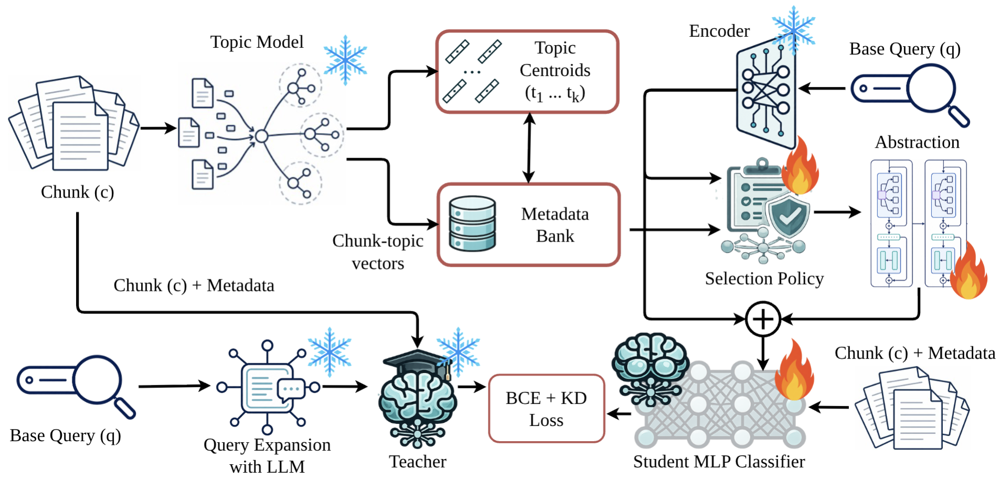

<div align="center">

# MCompassRAG

### Metadata-guided Retrieval-Augmented Generation with a pluggable topic *compass*

<p>


</p>

<em>Enrich coarse chunks with topic signals, distill an LLM teacher into a tiny retriever,<br>and rank documents at embedding-model latency — with <strong>zero LLM calls at inference</strong>.</em>

</div>

---

## Table of contents

1. [Why MCompassRAG](#why-mcompassrag)
2. [How it works](#how-it-works)
3. [Repository layout](#repository-layout)
4. [Pluggable topic models](#pluggable-topic-models)
5. [Prerequisites](#prerequisites)
6. [Installation](#installation)
   - [Option A — automated setup](#option-a--automated-setup-recommended)
   - [Option B — manual setup](#option-b--manual-setup)
7. [Prepare your data](#prepare-your-data)
8. [The pipeline, step by step](#the-pipeline-step-by-step)
   - [Step 1 — Train a topic model](#step-1--train-a-topic-model)
   - [Step 2 — Generate distillation data](#step-2--generate-distillation-data)
   - [Step 3 — Build the metadata index](#step-3--build-the-metadata-index)
   - [Step 4 — Train the retriever](#step-4--train-the-retriever)
   - [Step 5 — Run retrieval](#step-5--run-retrieval)
9. [Configuration reference](#configuration-reference)
10. [Swapping the topic model](#swapping-the-topic-model)
11. [Extending: add your own backend](#extending-add-your-own-backend)
12. [How the distillation signal works](#how-the-distillation-signal-works)
13. [Troubleshooting](#troubleshooting)
14. [Acknowledgements & license](#acknowledgements--license)

---

## Why MCompassRAG

Classic dense retrieval matches a query against chunk embeddings alone. That works until
your chunks are coarse, your corpus is broad, and "topically similar" stops meaning
"actually answers the question."

**MCompassRAG** adds a *semantic compass*: every chunk is annotated with a topic-model
signal, and a small neural scorer learns to combine the raw embedding with topic-aware
evidence. The ranking quality comes from an **LLM teacher** that judges query/chunk
relevance during an offline data-generation phase; that judgment is **distilled** into the
scorer. At inference time the teacher is gone — MCompassRAG ranks chunks with a precomputed
**metadata bank** and a lightweight model, so you get teacher-grade ranking at the cost of
an embedding lookup plus a few matrix multiplies.

The topic model is **pluggable**. Four backends ship in the box (CEMTM, ETM, CWTM,
SoftLTM), and adding your own is a single subclass. All of them expose topic centroids
**in the retriever's embedding space**, so nothing downstream changes when you swap them.

> **TL;DR** — Train a topic model → generate teacher-labeled data → bake an index →
> distill a retriever → query with no LLM calls.

---

## How it works


During training, an LLM teacher provides relevance supervision, with query expansion used only as an additional teacher-side metadata signal. The metadata bank is built from chunks, enriched with document-topic vectors and topic centroid embeddings. At inference time, MCompassRAG selects and abstracts query-relevant topic metadata, then scores query-chunk pairs with a lightweight student retriever.

---

## Repository layout

```
.
├── src/                      # RAG core (everything that runs at index/serve time)
│   ├── config.py             # YAML loader + dataclass binding
│   ├── run.py                # RAG CLI: build the index and/or run queries
│   ├── pipeline.py           # build_index / serve (+ *_from_config helpers)
│   ├── encoders/             # Qwen3 backbone + retriever encoder (leaf modules)
│   ├── index/                # chunking + the cached metadata bank
│   ├── models/               # selector, abstraction, scorer, CompassRetriever
│   ├── training/             # dataset, losses, trainer, train CLI
│   └── inference/            # Algorithm 1 retrieval
├── topic_models/             # pluggable backends + WikiWeb2M training
│   ├── base.py registry.py   # TopicModel interface + name registry
│   ├── wikiweb2m.py          # corpus loader / vocab / BoW
│   ├── cemtm_adapter.py      # CEMTM   (native centroids)
│   ├── etm_adapter.py        # ETM     (native centroids, retriever-grounded ρ)
│   ├── cwtm_adapter.py       # CWTM    (empirical centroids, MLM backbone)
│   ├── softltm_adapter.py    # SoftLTM (native centroids over LM soft labels)
│   └── train_topic_model.py  # training CLI
├── data_gen/                 # LLM-teacher distillation data generation
│   ├── openrouter_client.py  # cached, retrying OpenRouter client (+ logprobs)
│   ├── query_gen.py          # base/expanded query generation
│   ├── teacher.py            # logit-based relevance labeling
│   ├── negatives.py          # hard + random negative mining
│   └── build_training_data.py# generation CLI
├── configs/                  # one YAML per stage (+ configs/rag/<backend>.yaml)
├── scripts/                  # thin shell wrappers (setup, train, build, run)
├── third_party/              # cloned upstreams: CEMTM, CWTM, ETM  (git-ignored)
├── data/                     # corpus, chunks, generated train data  (git-ignored)
├── outputs/                  # topic models, index banks, retriever ckpts (git-ignored)
├── requirements.txt
└── README.md
```

A deliberate design choice keeps the import graph acyclic: the shared LM backbone lives in
`src/encoders`, so `src.encoders ← topic_models ← src.index / src.pipeline` and
`src.encoders ← data_gen`. `import src` is light (it never pulls in `torch`/`transformers`
at package import time).

---

## Pluggable topic models

Every backend takes a topic count `K`, trains on WikiWeb2M, and exposes topic centroids
**in the retriever's semantic space**, so the index and retriever are identical regardless
of which one you pick.

| Backend     | Native centroids? | Backbone               | Notes |
|-------------|:-----------------:|------------------------|-------|
| `cemtm`     | ✅ yes            | Qwen3-Embedding (shared) | Centroids are the CEMTM decoder columns; shares the retriever's backbone (no second download). |
| `etm`       | ✅ yes            | Qwen3-Embedding         | Topic embeddings `α_k` are native centroids; word embeddings `ρ` are **frozen retriever embeddings** of the vocab. |
| `cwtm`      | ⚠️ empirical      | MLM (`bert-base-uncased`) | No embedding-space topics; centroids are computed **empirically** from chunk embeddings. |
| `softltm`   | ✅ yes            | Qwen3-Embedding + label LM | ProdLDA encoder over an LM's soft labels with an ETM-style decoder → native centroids. |

> "Native" means the topic vectors are read straight from the trained model. "Empirical"
> means they're the responsibility-weighted mean of chunk embeddings (used when a backend
> has no embedding-space topics).

---

## Prerequisites

- **Python 3.10+**
- **A CUDA GPU** is strongly recommended. The default configs use `device: cuda`; for a
  laptop run set the `device` fields to `cpu` (or `mps` on Apple Silicon).
- **Git** (the setup script clones the upstream topic-model repos).
- **An OpenRouter API key** — only needed for [Step 2 (data generation)](#step-2--generate-distillation-data).
  Export it before running that step:

```bash
export OPENROUTER_API_KEY="sk-or-..."
```

---

## Installation

Clone the project and create an isolated environment first:

```bash
git clone https://github.com/your-org/MCompassRAG.git
cd MCompassRAG

python -m venv .venv
source .venv/bin/activate          # Windows: .venv\Scripts\activate
python -m pip install --upgrade pip
```

### Option A — automated setup (recommended)

```bash
bash scripts/setup.sh
```

This single command is **idempotent** and does everything:

1. Creates `third_party/`, `data/`, and `outputs/`.
2. Clones the three upstream topic-model repos into `third_party/` (skipping any that
   already exist):
   - `CEMTM`  → `third_party/CEMTM`
   - `CWTM`   → `third_party/CWTM`
   - `ETM`    → `third_party/ETM`
3. Installs Python dependencies from `requirements.txt`.
4. Downloads the NLTK data used by the WikiWeb2M harness and CWTM
   (`stopwords`, `wordnet`).

Re-running it later only clones what's missing, so it's safe to use as a "repair" command.

### Option B — manual setup

If you'd rather do it by hand (or your environment blocks the script):

```bash
# 1) Create the working directories
mkdir -p third_party data outputs

# 2) Clone the upstream topic models into third_party/
git clone --depth 1 https://github.com/AmirAbaskohi/CEMTM.git   third_party/CEMTM
git clone --depth 1 https://github.com/Fitz-like-coding/CWTM.git third_party/CWTM
git clone --depth 1 https://github.com/adjidieng/ETM.git         third_party/ETM

# 3) Install dependencies
pip install -r requirements.txt

# 4) Fetch NLTK data
python -c "import nltk; nltk.download('stopwords'); nltk.download('wordnet')"
```

> **Note on backends.** `etm` and `softltm` are self-contained reimplementations and do
> **not** require their clones at runtime — but cloning ETM is harmless and keeps the
> upstream handy for reference. `cemtm` imports the topic-head modules from
> `third_party/CEMTM`, and `cwtm` wraps `third_party/CWTM/model.py`, so those two clones
> **are** required when you use those backends. The default cloned-repo paths
> (`third_party/CEMTM`, `third_party/CWTM`) match the adapter defaults out of the box.

Verify the install:

```bash
python -c "import src, topic_models, data_gen; print('import OK')"
python -c "import topic_models; print('backends:', topic_models.available_topic_models())"
```

You should see `['cemtm', 'cwtm', 'etm', 'softltm']`.

---

## Prepare your data

MCompassRAG reads everything from `data/` (git-ignored). Two inputs drive the pipeline.

**1. The topic-model corpus — `data/wikiweb2m.jsonl`.**
One JSON object per line. The document text is the concatenation of whichever of
`section_text` / `text` / `content` fields are present; records shorter than
`min_doc_chars` are dropped.

```json
{"text": "Albert Einstein was a theoretical physicist ..."}
{"section_text": "The theory of general relativity ..."}
```

**2. The chunk corpus — `data/corpus_chunks.jsonl`.**
One chunk per line, with the fields below. `position` orders chunks **within a document**
and is used for neighbor mining during query generation.

```json
{"id": "doc12_3", "text": "The eardrum transmits sound ...", "doc_id": "doc12", "position": 3}
```

If you need to chunk raw documents, `src/index/chunking.py` provides a deterministic
token-window chunker (`chunk_documents`) that uses the retriever's tokenizer so chunk
boundaries align with the embedding model.

---

## The pipeline, step by step

Each step reads a YAML config and writes artifacts under `outputs/` (or `data/train/` for
generation). The five steps below compose by pointing at the same directories. For a
hands-off run, the [Quickstart](#quickstart) at the end chains them all.

### Step 1 — Train a topic model

Train a topic model on your WikiWeb2M corpus. The backend is selected by
`topic_model.name`.

Edit `configs/train_topic_model.yaml`:

```yaml
topic_model: {name: cemtm, num_topics: 100}     # cemtm | etm | cwtm | softltm
encoder:     {model_name: Qwen/Qwen3-Embedding-4B, dtype: bfloat16, max_length: 2048}
corpus:      {wikiweb2m_path: data/wikiweb2m.jsonl, max_docs: 200000, min_doc_chars: 200}
train:
  vocab_size: 2000
  min_word_freq: 5
  epochs: 20
  batch_size: 64
  lr: 2.0e-3
  centroid_source: native          # native | empirical  (cwtm forces empirical)
  centroid_normalize: true
  n_empirical_docs: 20000
  label_lm: meta-llama/Llama-3.2-1B-Instruct   # softltm only
  soft_label_tau: 3.0                           # softltm only
  recon_lambda: 1000.0                          # softltm only
  device: cuda
  seed: 13
backend_kwargs: {}                  # cemtm:{checkpoint_path: ...} | cwtm:{backbone: bert-base-uncased}
output: {save_dir: outputs/topic_models/cemtm_k100}
```

Run it:

```bash
bash scripts/train_topic_model.sh configs/train_topic_model.yaml
# equivalently:
python -m topic_models.train_topic_model --config configs/train_topic_model.yaml
```

**Output:** a saved topic model under `output.save_dir` (e.g.
`outputs/topic_models/cemtm_k100/`), containing the trained weights, the vocabulary, the
config, and the topic centroids.

**Per-backend tips**

- `cemtm` — pass an existing checkpoint via `backend_kwargs: {checkpoint_path: ...}` to skip
  training; otherwise it trains the CEMTM objective on your corpus.
- `cwtm` — choose the MLM backbone via `backend_kwargs: {backbone: bert-base-uncased}`. It
  ignores `centroid_source` and always uses empirical centroids.
- `softltm` — set the generative `label_lm`, `soft_label_tau`, and `recon_lambda`. The label
  LM is run **once** and cached, so training epochs are cheap.

### Step 2 — Generate distillation data

Generate (base, expanded) queries per chunk, mine hard + random negatives, and have an
**LLM teacher** label relevance. This is the only step that needs network/OpenRouter.

```bash
export OPENROUTER_API_KEY="sk-or-..."
```

Edit `configs/gen_train_data.yaml`:

```yaml
encoder: {model_name: Qwen/Qwen3-Embedding-4B, dtype: bfloat16, max_length: 2048}
corpus:  {chunks_path: data/corpus_chunks.jsonl}
datagen:
  n_target_chunks: 2000
  queries_per_chunk: 10
  n_random_negatives: 4
  n_hard_candidates: 20
  n_hard_negatives: 4
  neighbor_window: 1
  query_gen_model: openai/gpt-4o
  teacher_model: openai/gpt-4o
  temperature_qgen: 0.7
  temperature_teacher: 0.0
  trust_teacher_on_positive: false
  kd_on_random_negatives: false
  keep_useful_highsim_as_positive: false
  max_workers: 8
  seed: 13
  reasoning_effort: none       # forwarded to the LLM as {"reasoning": {"effort": ...}}
output: {out_dir: data/train}
```

Run it:

```bash
bash scripts/gen_train_data.sh configs/gen_train_data.yaml
# equivalently:
python -m data_gen.build_training_data --config configs/gen_train_data.yaml
```

**Output:** `data/train/train.jsonl`, `data/train/chunks.jsonl`, and
`data/train/datagen_config.json`. Each training record looks like:

```json
{
  "query_id": "q_doc12_3_0",
  "source_chunk_id": "doc12_3",
  "base_query": "How does the eardrum transmit sound?",
  "expanded_query": "In the human auditory system, how does the eardrum transmit sound to the inner ear?",
  "candidates": [
    {"chunk_id": "doc12_3", "role": "positive",        "y": 1, "z_t":  3.10, "has_teacher": true},
    {"chunk_id": "doc44_1", "role": "hard_negative",   "y": 0, "z_t": -2.40, "has_teacher": true},
    {"chunk_id": "doc09_7", "role": "random_negative", "y": 0, "z_t": null,  "has_teacher": false}
  ]
}
```

Here `y` is the binary relevance label and `z_t` is the **teacher logit** used for
distillation (see [How the distillation signal works](#how-the-distillation-signal-works)).
The teacher always judges the **expanded** query; hard-negative mining uses the **base**
query.

### Step 3 — Build the metadata index

Embed every chunk, compute its topic distribution with the trained topic model, and cache
the whole bank. This step uses `configs/rag/<backend>.yaml`.

`configs/rag/cemtm.yaml`:

```yaml
encoder:
  model_name: Qwen/Qwen3-Embedding-4B
  dtype: bfloat16
  max_length: 2048
  query_instruction: "Given a search query, retrieve relevant passages that answer it"
topic_model: {dir: outputs/topic_models/cemtm_k100}
index:
  chunks_path: data/corpus_chunks.jsonl
  out_dir: outputs/index/cemtm_k100
  top_m: 8
  chunk_batch_size: 16
  topic_batch_size: 8
retriever: {model_ckpt: outputs/retriever/cemtm_k100/best.pt}
serve: {k: 5, score_block_size: 4096, query_batch_size: 16, device: cuda}
```

Run it:

```bash
bash scripts/build_index.sh configs/rag/cemtm.yaml
# equivalently:
python -m src.run --config configs/rag/cemtm.yaml --build-index
```

**Output:** the metadata bank under `index.out_dir` (e.g. `outputs/index/cemtm_k100/`). The
build is skipped if the output already exists — pass `--force` to rebuild:

```bash
python -m src.run --config configs/rag/cemtm.yaml --build-index --force
```

### Step 4 — Train the retriever

Distill the teacher judgments into the selector + abstraction + scorer.

Edit `configs/train_retriever.yaml`:

```yaml
bank_dir: outputs/index/cemtm_k100
train_jsonl: data/train/train.jsonl
chunks_jsonl: data/train/chunks.jsonl
encoder: {model_name: Qwen/Qwen3-Embedding-4B, dtype: bfloat16, max_length: 2048}
model:
  top_l: 16
  top_m: 8                 # MUST equal the index top_m
  abstraction_layers: 2
  abstraction_heads: 4
  abstraction_ff: 256
  abstraction_dropout: 0.1
  abstraction_softmax: true
  pool: selection_weighted
  scorer_hidden: [1024, 256]
  scorer_dropout: 0.1
train:
  epochs: 5
  batch_size: 32
  lr: 2.0e-4
  weight_decay: 0.01
  warmup_ratio: 0.05
  grad_clip: 1.0
  alpha: 0.5
  tau: 2.0
  tau_squared_scale: true
  max_candidates_per_query: 16
  num_workers: 2
  val_fraction: 0.05
  eval_every_steps: 200
  log_every_steps: 50
  seed: 13
  device: cuda
output: {save_dir: outputs/retriever/cemtm_k100}
```

Run it:

```bash
bash scripts/train_retriever.sh configs/train_retriever.yaml
# equivalently:
python -m src.training.train --config configs/train_retriever.yaml
```

**Output:** the trained retriever checkpoint at `output.save_dir/best.pt` (e.g.
`outputs/retriever/cemtm_k100/best.pt`). The checkpoint stores the full model config, so
serving reconstructs `top_l`, `top_m`, and the rest automatically.

### Step 5 — Run retrieval

Now query with **no LLM calls**.

```bash
# build the index if needed, then ask a single question:
bash scripts/run_rag.sh configs/rag/cemtm.yaml "how does the eardrum transmit sound?"
```

Under the hood that wrapper calls `src.run`. You can also drive it directly:

```bash
# single query
python -m src.run --config configs/rag/cemtm.yaml --query "how does the eardrum transmit sound?"

# batch: one query per line in a file
python -m src.run --config configs/rag/cemtm.yaml --queries questions.txt

# override the number of results
python -m src.run --config configs/rag/cemtm.yaml --query "..." --k 10
```

Results print ranked, highest score first:

```
Query: how does the eardrum transmit sound?
  [0] score=8.7421 id=doc12_3  The eardrum transmits sound vibrations to the three small bones ...
  [1] score=6.1185 id=doc12_4  These ossicles amplify the vibration before it reaches the cochlea ...
  ...
```

<a name="quickstart"></a>

### Quickstart (the whole thing)

```bash
bash scripts/setup.sh                                              # clone upstreams, install deps, NLTK data
bash scripts/train_topic_model.sh configs/train_topic_model.yaml   # data/wikiweb2m.jsonl -> outputs/topic_models/...
bash scripts/gen_train_data.sh    configs/gen_train_data.yaml      # data/corpus_chunks.jsonl -> data/train/
bash scripts/build_index.sh       configs/rag/cemtm.yaml           # chunks + topics -> outputs/index/...
bash scripts/train_retriever.sh   configs/train_retriever.yaml     # distill teacher -> outputs/retriever/.../best.pt
bash scripts/run_rag.sh           configs/rag/cemtm.yaml "your question here"
```

---

## Configuration reference

There are four config families, all parsed by `src.config.load_yaml` and bound onto the
project's dataclasses (unknown keys are ignored; missing keys keep defaults).

| File | Stage | Binds to |
|------|-------|----------|
| `configs/train_topic_model.yaml` | Step 1 | `TopicTrainConfig`, encoder, corpus |
| `configs/gen_train_data.yaml`    | Step 2 | `DataGenConfig`, encoder, corpus |
| `configs/train_retriever.yaml`   | Step 4 | `CompassModelConfig`, `TrainConfig`, encoder |
| `configs/rag/<backend>.yaml`     | Steps 3 & 5 | `IndexConfig`, `CompassRAGConfig`, encoder |

Keep **one RAG config per topic backend** (`cemtm.yaml`, `etm.yaml`, `cwtm.yaml`,
`softltm.yaml`); they differ only in the `topic_model.dir`, `index.out_dir`, and
`retriever.model_ckpt` paths.

**Must-match constraints** (enforced at runtime):

- `model.top_m` (retriever) **must equal** `index.top_m`. The chunk topic-summary `g_c` is
  baked into the bank with the index value, and the model recomputes `g_q` with its own — if
  they diverge, the representations don't line up.
- The encoder `model_name` must be **consistent** across the topic model, the index, the
  retriever, and serving — they all share one embedding space.

> `top_l` lives **only** in `configs/train_retriever.yaml`. It's a property of the trained
> model (how many bank entries the selector pulls in), it's saved inside the checkpoint, and
> it's never used at index time — so it intentionally does not appear in the RAG configs.

---

## Swapping the topic model

1. Set `topic_model.name` (and any `backend_kwargs`) in `configs/train_topic_model.yaml`,
   then train:

   ```bash
   bash scripts/train_topic_model.sh configs/train_topic_model.yaml
   ```

2. Point the matching `configs/rag/<name>.yaml` at the new directories
   (`topic_model.dir`, `index.out_dir`, `retriever.model_ckpt`). Copies for `etm`, `cwtm`,
   and `softltm` are provided.

3. Rebuild the index and retrain the retriever against that config. Nothing downstream of
   the topic model changes, because every backend exposes centroids in the same retriever
   space.

---

## Extending: add your own backend

Implement a new topic model in four steps:

```python
from topic_models.base import TopicModel
from topic_models.registry import register_topic_model


@register_topic_model("mybackend")
class MyTopicModel(TopicModel):
    def supports_native_centroids(self) -> bool:
        return True  # or False to fall back to empirical centroids

    def encode_topic_distribution(self, texts):
        ...          # -> (B, K) simplex

    def _native_centroids(self):
        ...          # -> (K, d) in the retriever space (or None)

    def fit(self, corpus, cfg):
        ...          # train on the WikiWeb2M corpus
```

1. Subclass `TopicModel`.
2. Implement `encode_topic_distribution`, `_native_centroids`, `fit`, and
   `supports_native_centroids`.
3. Decorate with `@register_topic_model("mybackend")`.
4. Import it from `topic_models/__init__.py` so the decorator runs on package import.

It's then immediately usable via `build_topic_model("mybackend", K, encoder, ...)` and by
setting `topic_model.name: mybackend` in the training config.

---

## Acknowledgements & license

MCompassRAG builds on four upstream topic models, isolated under `third_party/`:

- **CEMTM** — Contextual Embedding-based Multimodal Topic Model — <https://github.com/AmirAbaskohi/CEMTM>
- **CWTM** — Contextualized Word Topic Model — <https://github.com/Fitz-like-coding/CWTM>
- **ETM** — Embedded Topic Model — <https://github.com/adjidieng/ETM>
- **SoftLTM** — Improving Neural Topic Modeling with Semantically-Grounded Soft Label Distributions — <https://arxiv.org/abs/2602.17907>

Released under the **MIT License**.

---

## Citation
```
@misc{abaskohi2026mcompassragtopicmetadatasemantic,
      title={MCompassRAG: Topic Metadata as a Semantic Compass for Paragraph-Level Retrieval}, 
      author={Amirhossein Abaskohi and Raymond Li and Gaetano Cimino and Peter West and Giuseppe Carenini and Issam H. Laradji},
      year={2026},
      eprint={2606.18508},
      archivePrefix={arXiv},
      primaryClass={cs.CL},
      url={https://arxiv.org/abs/2606.18508}, 
}
```
